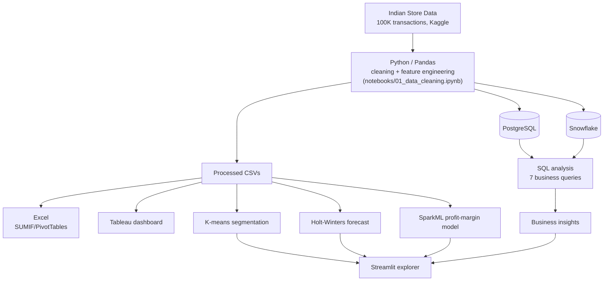
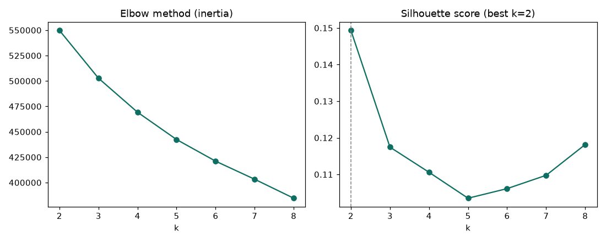
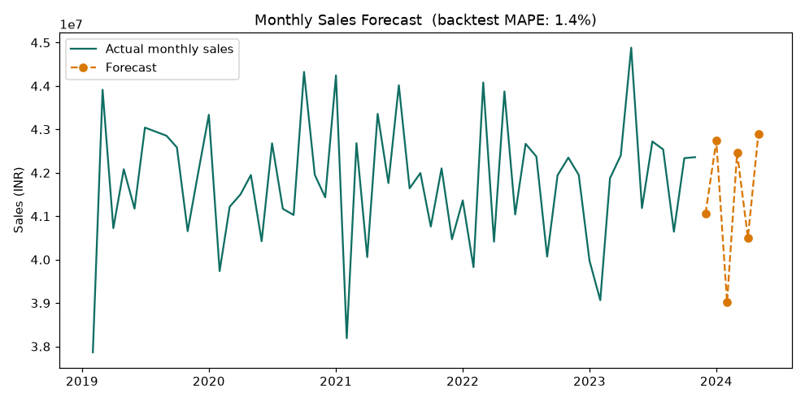

# Indian Retail Sales Analytics

End-to-end analyst project: raw data → Python cleaning → SQL analysis (PostgreSQL +
Snowflake) → Excel summary → Tableau dashboard → ML segmentation/forecasting → interactive
app. Built to demonstrate the exact toolkit most requested in Data/BI Analyst and Data
Scientist screens: **SQL, Excel, Python, a BI tool, and applied ML.**

**Dataset:** [Indian Store Data](https://www.kaggle.com/datasets/abuhumzakhan/store-data) (Kaggle)
— ~100,000 retail transactions, 2019–2023, INR, with region/state/city-tier fields.
The full dataset isn't committed to this repo (100K rows of raw data doesn't belong in git
regardless, and it's worth respecting the source's own license) — see
[`data/raw/README.md`](data/raw/README.md) for exact download and setup steps. A small
synthetic sample ships in the repo so the pipeline can be sanity-checked without downloading
anything first.

## Executive summary

**Key findings**
1. Deep discounts increase order volume but steadily erode margin (20.0% → 12.0% as
   discount depth increases).
2. The 11–30% discount band is the weakest margin/volume trade-off in the dataset — worse
   margin than light discounting, without the volume payoff of deep discounting.
3. Region, category, and city-tier performance are all essentially flat (~14.8–15.2% margin
   everywhere) — the real variance here is in discounting behavior, not geography or mix.
4. The dataset contains **zero repeat-purchase behavior** — 100,000 orders, 100,000 unique
   customers, one order each.
5. Ship-mode data likely has a labeling error — "Same Day" shows ~4 days average delivery,
   same as every other mode.

**Recommended actions**
- Tighten discount policy specifically in the 11–30% band, rather than discounting broadly.
- Investigate the Same Day shipping label before using ship-mode data operationally.
- Introduce a repeat-purchase incentive — even a 10% repeat rate on existing customers is
  worth an estimated ₹37.5M in incremental profit, at no acquisition cost.
- Treat regional/category targeting as a lower-priority lever than discount-tier policy,
  given how flat performance is across both.

Full reasoning and supporting numbers for each point are in
[Key findings](#key-findings-from-the-real-100k-row-dataset) and
[Business recommendations](#business-recommendations) below.

## Architecture



## Results at a glance

**Order segmentation (K-means) — silhouette 0.149, k=2:**



**Monthly sales forecast (Holt-Winters) — 1.4% backtest MAPE:**



**Tableau dashboard, Streamlit app, and Excel workbook** — screenshots not yet embedded here;
live links below until they're added:
- Tableau: see [Dashboard](#dashboard) section
- Streamlit: run locally per [How to run](#how-to-run), or deploy your own copy free on
  [Streamlit Community Cloud](https://share.streamlit.io) — point it at `app/streamlit_app.py`.
  No dataset upload needed: it auto-generates from the committed synthetic sample if the
  real processed data isn't present (see the in-app notice when that happens).
- Excel: [`excel/regional_performance_summary.xlsx`](excel/regional_performance_summary.xlsx)
  (download and open directly — PivotTables/charts don't render in GitHub's file preview)

## Business questions
See [`business_questions.md`](business_questions.md) — six questions a retail operations lead
would actually ask, each mapped to the SQL query that answers it.

## Project structure
```
├── data/
│   ├── raw/              synthetic sample + README with real-dataset download instructions
│   └── processed/        cleaned, normalized tables (customers, products, orders)
├── notebooks/
│   └── 01_data_cleaning.ipynb    load → audit → clean → feature-engineer → normalize
├── sql/
│   ├── 01_schema.sql               PostgreSQL DDL for the normalized tables
│   ├── 01b_schema_snowflake.sql    Snowflake DDL (same schema, different engine)
│   ├── 02_business_queries.sql     7 queries: joins, window functions, CTEs
│   ├── load_data.py                loads the processed CSVs into PostgreSQL
│   └── load_data_snowflake.py      loads the processed CSVs into Snowflake
├── excel/
│   ├── regional_performance_summary.xlsx   live SUMIF/SUMIFS formulas, native charts,
│   │                                        and native PivotTables
│   └── update_excel_raw_data.py            refreshes the Raw Data sheet after re-running
│                                            the notebook, without touching the formulas
├── analysis/
│   ├── clustering_segmentation.py   order-level K-means segmentation
│   ├── forecasting.py               Holt-Winters monthly sales forecast, with backtest
│   └── sparkml_pipeline.py          PySpark/SparkML profit-margin regression vs. baseline
├── tests/
│   └── test_data_quality.py         16 pytest data-quality checks (schema, referential
│                                     integrity, business-logic invariants)
├── app/
│   └── streamlit_app.py             interactive, filterable companion to the Tableau dashboard
├── scripts/
│   └── build_processed_from_sample.py   builds processed data from the sample, used by CI
├── .github/workflows/
│   └── tests.yml                    lint (ruff) + data-quality tests on every push
├── dashboard/
│   └── BUILD_GUIDE.md    field-by-field spec for the Tableau dashboard
└── business_questions.md
```

## How to run
```bash
# 1. Set up Python
python3 -m venv venv && source venv/bin/activate
pip install -r requirements.txt

# 2. Get the real dataset (see data/raw/README.md), save it as
#    data/raw/indian_store_data.csv, then run the cleaning notebook
jupyter nbconvert --to notebook --execute --inplace notebooks/01_data_cleaning.ipynb

# 3. Load it into PostgreSQL (adjust host/port to your own setup)
psql -h localhost -U postgres -d retail_analytics -f sql/01_schema.sql
python sql/load_data.py
psql -h localhost -U postgres -d retail_analytics -f sql/02_business_queries.sql
```
Then:
- Refresh the Excel workbook: `python excel/update_excel_raw_data.py`, then open it in
  Excel or LibreOffice Calc — the SUMIF/SUMIFS formulas and PivotTables recalculate
  automatically against the new data.
- Rebuild the dashboard per [`dashboard/BUILD_GUIDE.md`](dashboard/BUILD_GUIDE.md) — built
  here using Tableau Public's free browser-based Web Authoring, since the Tableau/Power BI
  desktop apps don't run on Linux.
- Explore interactively: `streamlit run app/streamlit_app.py` — filterable KPIs and charts
  alongside the static Tableau dashboard.
- Load into Snowflake instead of (or alongside) Postgres: see
  [Snowflake](#snowflake-cloud-data-warehouse) below.

## Key findings (from the real ~100K-row dataset)
- **Discounting is eroding margin at real scale.** Average margin drops steadily from 20.0%
  (no discount, 949 orders) to 12.0% (30%+ discount) — a clean, monotonic decline. The 30%+
  tier is also 39% of all orders and generates the single highest total profit (₹118M) of any
  discount bucket, purely on volume.
- **Region, category, and city-tier performance are all essentially flat.** Margin sits in a
  tight ~14.8%–15.2% band everywhere, with no standout or underperforming segment. The
  meaningful variance in this dataset is in discounting behavior, not geography or product mix.
- **Every customer in this dataset has exactly one order** (100,000 orders, 100,000 unique
  customer IDs) — there's no repeat-purchase signal to analyze here, which is itself worth
  calling out rather than glossing over.
- **Data quality flag:** ship-mode analysis shows ~4 days average delivery time across *all
  four* modes, including "Same Day" — almost certainly a labeling artifact in the source data
  rather than a real operational finding. Flagged rather than reported as fact.

## Business recommendations

1. **Segment the discount strategy instead of cutting discounts broadly.** Total profit
   follows a U-shape across discount depth: ₹93M (1–10%) drops to ₹74M (21–30%) before
   jumping to ₹118M (30%+). The 11–30% range is the genuinely worst trade-off — lower margin
   than light discounting, without the volume payoff of deep discounting — and is the range
   worth testing tighter limits on, rather than discounting broadly.
2. **Audit the "Same Day" delivery labeling before using ship-mode data operationally.**
   All four ship modes show ~4 days average delivery time, including Same Day — a same-day
   service that takes 4 days isn't actually same-day. This points to either a data-entry
   error or a fulfillment promise that isn't being met, and should be resolved before any
   customer-facing delivery commitments or ship-mode analysis are built on this data.
3. **Zero repeat-purchase behavior across 100,000 orders means growth is currently 100%
   dependent on new-customer acquisition.** Average order value is ~₹25,000; even a modest
   10% repeat-purchase rate among existing customers would generate ~10,000 additional
   orders, or roughly ₹37.5M in incremental profit at the dataset's ~15% average margin —
   an untapped lever with no execution cost beyond the incentive program itself.

## Extended analysis: segmentation, forecasting, SparkML

Three additional analyses on top of the core pipeline, plus a test suite and an interactive
app — see [`analysis/`](analysis/), [`tests/`](tests/), and [`app/`](app/).

**Order segmentation (K-means).** Segments orders by discount depth, basket size, and margin
rather than customer-level RFM — every customer here has exactly one order, so RFM would be
degenerate (Frequency = 1 for all 100,000 customers). Best k = 2, silhouette 0.149:
"Deep-Discount, Thin-Margin" (53,210 orders, 35.9% avg discount, 11.6% avg margin) vs.
"Full-Price, High-Margin" (46,790 orders, 12.9% avg discount, 18.7% avg margin).

**Monthly sales forecasting (Holt-Winters), with a proper train/validation split:**
- Train period: 2019-02 to 2023-05 (52 months)
- Validation (backtest) period: 2023-06 to 2023-11 (6 months, held out)
- Forecast period: 2023-12 to 2024-05 (6 months forward)
- Backtest results: **MAPE 1.4%**, **MAE ₹580,562**, **RMSE ₹714,277**

The plot above shows both panels: full history + forward forecast, and a zoomed-in
actual-vs-predicted view of just the backtest window — the second panel is what actually
substantiates the accuracy numbers, rather than asking the reader to trust a single percentage.

**SparkML profit-margin prediction, evaluated against a baseline, not in isolation:**
- Baseline (predict the training-set mean for every row): RMSE 0.0525
- GBTRegressor: **RMSE 0.0441, MAE 0.0374, R² 0.295**
- **Improvement over baseline: 16.0%**

Feature engineering is reprocessed in PySpark DataFrames; the GBTRegressor predicts profit
margin from order characteristics (sales, quantity, discount, delivery days, category,
ship mode). Runs on a local Spark session (`local[*]`) — not a real multi-node cluster,
worth saying plainly if asked.

**Data quality tests.** 16 pytest tests covering schema, referential integrity (orders →
customers/products), value ranges, and business-logic invariants (e.g. ship_date ≥
order_date, profit_margin actually equals profit/sales). All 16 pass against the production
dataset, and run automatically on every push via GitHub Actions (lint + tests — see badge
at the top of this README).

**Interactive explorer.** `app/streamlit_app.py` — a filterable companion to the static
Tableau dashboard: region/category/city-tier/date filters with KPIs and charts recomputed
live.

Run any of these yourself:
```bash
cd analysis
python clustering_segmentation.py
python forecasting.py --periods 6
python sparkml_pipeline.py
cd ..
pytest tests/ -v
streamlit run app/streamlit_app.py
```

## Dashboard
[Indian Retail Sales Analytics — live on Tableau Public](https://public.tableau.com/app/profile/ishani.sarkar2749/viz/IndianRetailSalesAnalytics_17859999640720/Dashboard1)

## Snowflake (cloud data warehouse)

The same normalized schema and business queries also run on Snowflake, alongside the
PostgreSQL setup above — same SQL skills, different engine.

**Setup:**
1. Create a free trial account at https://signup.snowflake.com/ (30 days, no card needed)
2. Find your account identifier: Snowsight → your account name (bottom-left or top-right,
   depending on layout) → "View account details"
3. Set credentials as environment variables (never hardcode these):
   ```bash
   export SNOWFLAKE_ACCOUNT="your-account-identifier"
   export SNOWFLAKE_USER="your-username"
   export SNOWFLAKE_PASSWORD="your-password"
   export SNOWFLAKE_WAREHOUSE="COMPUTE_WH"   # default trial warehouse
   ```
4. Run:
   ```bash
   pip install "snowflake-connector-python[pandas]"
   python sql/load_data_snowflake.py
   ```

This creates the database/schema/tables (`sql/01b_schema_snowflake.sql`) and bulk-loads the
processed CSVs via `write_pandas` (Parquet-staged bulk load, not row-by-row inserts). The
same 7 queries in `sql/02_business_queries.sql` run unchanged against this schema — window
functions, CTEs, and `::numeric` casts all work identically in Snowflake.

**Worth knowing if asked about this in an interview:** Snowflake accepts PRIMARY KEY/FOREIGN
KEY constraints syntactically but doesn't enforce them at write time the way Postgres does —
they're optimizer hints, not guarantees. Data quality here is enforced upstream instead, by
`tests/test_data_quality.py`.

## CI

Every push to `main` runs, via GitHub Actions (`.github/workflows/tests.yml`):
1. Lint (`ruff check analysis/ tests/ app/`)
2. Build processed data from the synthetic sample (CI doesn't have the real 100K-row dataset)
3. Run the 16-test pytest suite

See the badge at the top of this README for current status.
